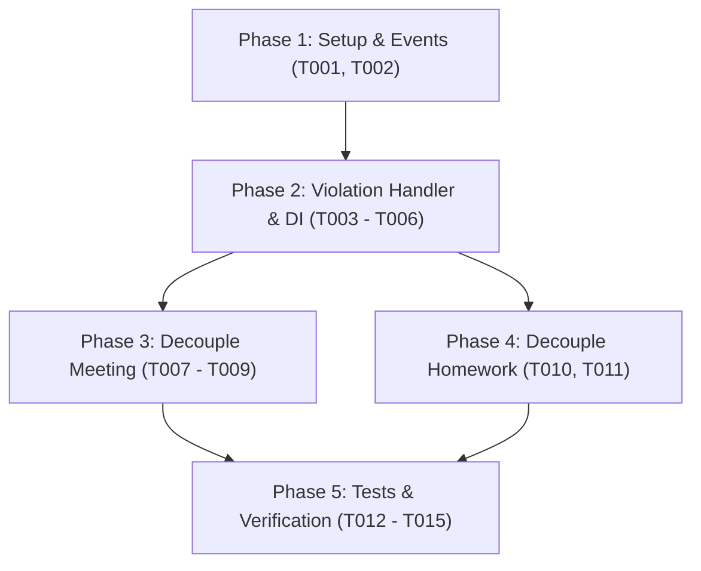

# Tasks: Refactor Kiến Trúc Violation Domain Theo Mô Hình Event-Driven

**Branch**: `002-violation-event-driven-refactor` | **Date**: 2026-09-25 | **Spec**: [spec.md](spec.md) | **Plan**: [plan.md](plan.md)

## Overview

Danh sách công việc thực thi tái cấu trúc Event-Driven cho Violation Domain, loại bỏ hoàn toàn sự phụ thuộc trực tiếp từ Meeting và Homework.

---

## Phase 1: Setup & Domain Events Definition

- [X] T001 [P] Định nghĩa Domain Events `ParticipantAbsenceRecorded` và `ParticipantLateRecorded` trong `backend/app/meeting/domain/events.py`
- [X] T002 [P] Chuẩn hóa Domain Event `HomeworkOverdueDetected` trong `backend/app/homework/domain/value_objects.py`

---

## Phase 2: Foundational Handlers & DI Wiring (Violation Domain)

- [X] T003 Nâng cấp `AutomatedViolationHandler` trong `backend/app/violation/application/event_handlers.py` để xử lý `ParticipantAbsenceRecorded` (tra cứu đơn `ABSENCE`, cập nhật status thành viên và tạo vi phạm nếu không phép)
- [X] T004 Nâng cấp `AutomatedViolationHandler` trong `backend/app/violation/application/event_handlers.py` để xử lý `ParticipantLateRecorded` (tra cứu đơn `LATE`, đối soát thời gian check-in vs giờ xin phép và tạo vi phạm nếu trễ không phép)
- [X] T005 Cập nhật xử lý `HomeworkOverdueDetected` trong `AutomatedViolationHandler` tại `backend/app/violation/application/event_handlers.py` (tra cứu đơn `POSTPONE` và tạo vi phạm nếu quá hạn)
- [X] T006 Cập nhật Dishka provider cho `AutomatedViolationHandler` trong `backend/app/violation/providers.py` và đăng ký lắng nghe các sự kiện mới trong `backend/app/core/events.py`

---

## Phase 3: User Story 1 & 3 - Decouple Meeting Domain (Priority: P1)

**Goal**: Domain Meeting chỉ đánh giá điểm danh và phát tán sự kiện; xóa sạch import và dependency liên quan đến Violation & PermissionRequest.

- [X] T007 [US1] Xóa bỏ `CreateViolationUseCase` và `PermissionRequestRepository` khỏi `CheckMeetingAttendanceUseCase` trong `backend/app/meeting/application/attendance_use_cases.py`
- [X] T008 [US1] Cập nhật `CheckMeetingAttendanceUseCase` trong `backend/app/meeting/application/attendance_use_cases.py` để phát `ParticipantAbsenceRecorded` (khi chưa checkin) và `ParticipantLateRecorded` (khi checkin trễ) lên `EventBus`
- [X] T009 [US1] Cập nhật Dishka provider cho `CheckMeetingAttendanceUseCase` trong `backend/app/meeting/providers.py` để bỏ 2 dependency `create_violation_uc` và `permission_repo`

---

## Phase 4: User Story 2 & 3 - Decouple Homework Domain (Priority: P1)

**Goal**: Domain Homework chỉ kiểm tra nộp bài và phát tán `HomeworkOverdueDetected`; chuyển logic kiểm tra đơn xin hoãn về Violation domain.

- [X] T010 [US2] Xóa bỏ `PermissionRequestRepository` khỏi `CheckOverdueHomeworkUseCase` trong `backend/app/homework/application/checker_use_cases.py` và phát trực tiếp `HomeworkOverdueDetected` lên `EventBus`
- [X] T011 [US2] Cập nhật Dishka provider cho `CheckOverdueHomeworkUseCase` trong `backend/app/homework/providers.py` để loại bỏ `permission_repo`

---

## Phase 5: Testing & Zero Regression Verification (Priority: P2)

**Goal**: Đảm bảo 100% test cases vượt qua, bảo đảm tính toàn vẹn và không còn bất kỳ coupling nào.

- [X] T012 [P] [US3] Viết bộ Unit Test toàn diện cho `AutomatedViolationHandler` trong `backend/tests/test_violation_event_handlers.py` kiểm thử các kịch bản vắng/trễ/hoãn có phép và không phép
- [X] T013 [P] [US3] Cập nhật Unit Tests trong `backend/tests/test_meeting_use_cases.py` tương thích với `CheckMeetingAttendanceUseCase` mới (mock EventBus)
- [X] T014 [P] [US3] Cập nhật Unit Tests trong `backend/tests/test_homework_checker.py` tương thích với `CheckOverdueHomeworkUseCase` mới
- [X] T015 [US3] Chạy kiểm tra tĩnh kiến trúc (kiểm tra không còn import `app.violation` trong `app/meeting`) và chạy toàn bộ test suite `pytest backend/tests/`

---

## Dependencies & Execution Order

---

## Implementation Strategy

- **MVP Slice (Phase 1 ➔ Phase 3)**: Hoàn thiện luồng Event-Driven cho Meeting Domain trước.
- **Incremental Expansion (Phase 4)**: Áp dụng tiếp cho Homework Domain.
- **Quality Gate (Phase 5)**: Chạy toàn bộ pytest suite đảm bảo Zero Regression trước khi bàn giao.
