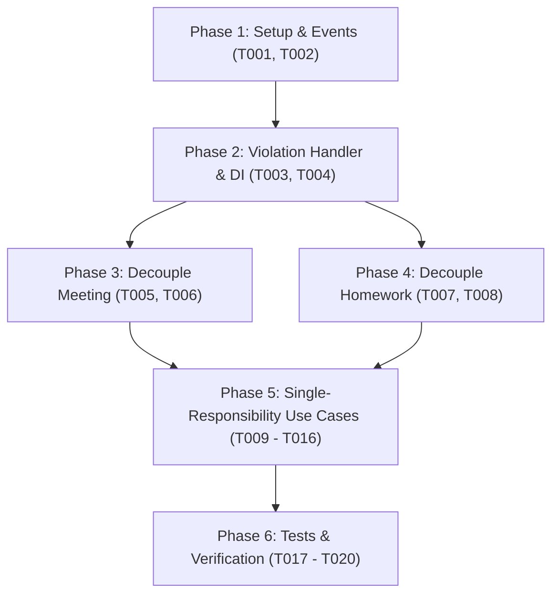

# Tasks: Refactor Kiến Trúc Violation Domain Theo Mô Hình Event-Driven & Phân Tách Use Cases

**Branch**: `002-violation-event-driven-refactor` | **Date**: 2026-09-25 | **Spec**: [spec.md](spec.md) | **Plan**: [plan.md](plan.md)

## Overview

Danh sách công việc thực thi tái cấu trúc Event-Driven cho Violation Domain, loại bỏ hoàn toàn sự phụ thuộc trực tiếp từ Meeting và Homework, đồng thời phân tách toàn bộ Use Cases thành các file độc lập (1 File / 1 Use Case) tuân thủ Clean Architecture.

---

## Phase 1: Setup & Domain Events Definition

**Purpose**: Định nghĩa các sự kiện nghiệp vụ thuần túy làm nền tảng cho Event-Driven Architecture.

- [X] T001 [P] Định nghĩa Domain Events `ParticipantAbsenceRecorded` và `ParticipantLateRecorded` trong `backend/app/meeting/domain/events.py`
- [X] T002 [P] Chuẩn hóa Domain Event `HomeworkOverdueDetected` trong `backend/app/homework/domain/value_objects.py`

---

## Phase 2: Foundational Handlers & DI Wiring (Violation Domain)

**Purpose**: Thiết lập bộ xử lý trung tâm tự động đối soát và xử phạt vi phạm tại Violation Domain.

- [X] T003 Nâng cấp `AutomatedViolationHandler` trong `backend/app/violation/application/event_handlers.py` để xử lý `ParticipantAbsenceRecorded`, `ParticipantLateRecorded`, và `HomeworkOverdueDetected` (tra cứu đơn xin phép, cập nhật status participant và tạo vi phạm nếu không phép)
- [X] T004 Cập nhật Dishka provider cho `AutomatedViolationHandler` trong `backend/app/violation/providers.py` và đăng ký lắng nghe các sự kiện mới trong `backend/app/core/events.py`

---

## Phase 3: User Story 1 & 3 - Decouple Meeting Domain (Priority: P1) 🎯 MVP

**Goal**: Domain Meeting chỉ đánh giá điểm danh và phát tán sự kiện; xóa sạch import và dependency liên quan đến Violation & PermissionRequest.

- [X] T005 [US1] Xóa bỏ `CreateViolationUseCase` và `PermissionRequestRepository` khỏi `CheckMeetingAttendanceUseCase` trong `backend/app/meeting/application/attendance_use_cases.py` và phát sự kiện `ParticipantAbsenceRecorded` / `ParticipantLateRecorded` lên `EventBus`
- [X] T006 [US1] Cập nhật Dishka provider cho `CheckMeetingAttendanceUseCase` trong `backend/app/meeting/providers.py` để loại bỏ 2 dependency `create_violation_uc` và `permission_repo`

---

## Phase 4: User Story 2 & 3 - Decouple Homework Domain (Priority: P1)

**Goal**: Domain Homework chỉ kiểm tra nộp bài và phát tán `HomeworkOverdueDetected`; chuyển logic kiểm tra đơn xin hoãn về Violation domain.

- [X] T007 [US2] Xóa bỏ `PermissionRequestRepository` khỏi `CheckOverdueHomeworkUseCase` trong `backend/app/homework/application/checker_use_cases.py` và phát trực tiếp `HomeworkOverdueDetected` lên `EventBus`
- [X] T008 [US2] Cập nhật Dishka provider cho `CheckOverdueHomeworkUseCase` trong `backend/app/homework/providers.py` để loại bỏ `permission_repo`

---

## Phase 5: User Story 5 - Single-Responsibility Use Cases Refactoring (Priority: P2)

**Goal**: Tách rời toàn bộ Use Case trong `Meeting` và `Violation` thành các file độc lập (1 class / 1 file) và export tập trung qua `__init__.py`.

### Violation Use Cases:
- [X] T009 [P] [US5] Tạo các file Use Case riêng biệt trong `backend/app/violation/application/`:
  - `create_violation_use_case.py` (`CreateViolationUseCase`)
  - `get_violations_use_case.py` (`GetViolationsUseCase`)
  - `update_violation_use_case.py` (`UpdateViolationUseCase`)
  - `delete_violation_use_case.py` (`DeleteViolationUseCase`)
  - `restore_violation_use_case.py` (`RestoreViolationUseCase`)
- [X] T010 [US5] Tạo `backend/app/violation/application/__init__.py` re-export 5 use cases trên và xóa file `backend/app/violation/application/use_cases.py` cũ
- [X] T011 [US5] Cập nhật imports trong `backend/app/violation/controller.py` và `backend/app/violation/providers.py`

### Meeting Use Cases:
- [X] T012 [P] [US5] Tạo các file CRUD Use Case riêng biệt trong `backend/app/meeting/application/`:
  - `create_meeting_use_case.py` (`CreateMeetingUseCase`)
  - `get_meetings_use_case.py` (`GetMeetingsUseCase`)
  - `update_meeting_use_case.py` (`UpdateMeetingUseCase`)
  - `delete_meeting_use_case.py` (`DeleteMeetingUseCase`)
- [X] T013 [P] [US5] Tạo các file Check-in & Capacity Use Case riêng biệt trong `backend/app/meeting/application/`:
  - `checkin_use_case.py` (`CheckInUseCase`)
  - `checkin_with_card_use_case.py` (`CheckInWithCardUseCase`)
  - `checkout_use_case.py` (`CheckOutUseCase`)
  - `calculate_current_capacity_use_case.py` (`CalculateCurrentCapacityUseCase`)
- [X] T014 [P] [US5] Tạo các file Attendance Use Case riêng biệt trong `backend/app/meeting/application/`:
  - `check_meeting_attendance_use_case.py` (`CheckMeetingAttendanceUseCase`)
  - `update_participant_status_use_case.py` (`UpdateParticipantStatusUseCase`)
- [X] T015 [US5] Tạo `backend/app/meeting/application/__init__.py` re-export 10 use cases trên và xóa các file gộp cũ (`crud_use_cases.py`, `checkin_use_cases.py`, `attendance_use_cases.py`, `capacity_use_cases.py`, `use_cases.py`)
- [X] T016 [US5] Cập nhật imports trong `backend/app/meeting/controller.py`, `backend/app/meeting/providers.py`, `backend/app/meeting/application/event_handlers.py`

---

## Phase 6: Testing & Zero Regression Verification (Priority: P2)

**Purpose**: Đảm bảo 100% test cases vượt qua, bảo đảm tính toàn vẹn và không còn bất kỳ coupling nào.

- [X] T017 [P] [US3] Cập nhật và xác thực Unit Tests trong `backend/tests/test_violation_event_handlers.py`
- [X] T018 [P] [US3] Cập nhật imports và test cases trong `backend/tests/test_meeting_use_cases.py`
- [X] T019 [P] [US3] Cập nhật imports và test cases trong `backend/tests/test_violation_use_cases.py` và `backend/tests/test_homework_checker.py`
- [X] T020 [US3] Chạy kiểm tra tĩnh kiến trúc (kiểm tra không còn import `app.violation` trong `app/meeting`) và chạy toàn bộ test suite `pytest backend/tests/`

---

## Dependencies & Execution Order

---

## Parallel Execution Opportunities

- **Phase 1**: T001 và T002 có thể thực thi song song.
- **Phase 5 (Violation)**: T009 có thể tạo song song 5 file use case.
- **Phase 5 (Meeting)**: T012, T013, T014 có thể tạo song song.
- **Phase 6**: T017, T018, T019 có thể chạy và cập nhật song song.

---

## Implementation Strategy

- **MVP Slice (Phase 1 ➔ Phase 4)**: Đảm bảo luồng nghiệp vụ Event-Driven hoạt động hoàn hảo trước.
- **Structural Modernization (Phase 5)**: Phân tách 15 file Use Case độc lập và re-export qua `__init__.py`.
- **Quality Gate (Phase 6)**: Chạy toàn bộ pytest suite đảm bảo Zero Regression trước khi bàn giao.
