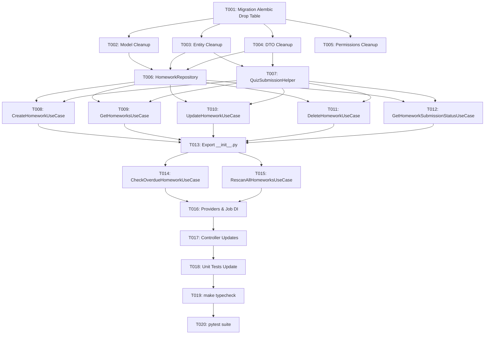

# Tasks: Tối Ưu Và Dọn Dẹp Domain Homework

**Input**: Design documents from `specs/003-homework-cleanup/` (`spec.md`, `plan.md`, `research.md`, `data-model.md`, `contracts/homework_api.md`, `quickstart.md`)

**Prerequisites**: `plan.md` (required), `spec.md` (required), `data-model.md`, `contracts/homework_api.md`

**Organization**: Tasks are grouped by foundational infrastructure and user stories to enable independent implementation and testing.

## Format: `- [ ] [TaskID] [P?] [Story?] Description with file path`

- **[P]**: Can run in parallel (different files, no dependencies)
- **[Story]**: Which user story this task belongs to (e.g., [US1], [US2], [US3], [US4])

---

## Phase 1: Setup & Database Migration

**Purpose**: Quản lý schema database PostgreSQL thông qua Alembic migration

- [x] T001 Tạo migration Alembic drop bảng `homework_teams` trong `backend/alembic/versions/`

---

## Phase 2: Foundational (Data Model & Schema Cleanup)

**Purpose**: Dọn dẹp các model, entity, DTO và enum legacy để làm tiền đề cho các Use Case

- [x] T002 [P] Xóa model `HomeworkTeamModel` và quan hệ `teams` khỏi `HomeworkModel` trong `backend/app/homework/infrastructure/model.py`
- [x] T003 [P] Xóa class entity `HomeworkSubmission` và các thuộc tính `team_ids`, `submissions` khỏi `Homework` entity trong `backend/app/homework/domain/entity.py`
- [x] T004 [P] Xóa các DTO legacy `HomeworkSubmissionCreate`, `HomeworkSubmissionUpdate`, `HomeworkSubmissionResponse`, và trường `team_ids` khỏi `HomeworkCreate`, `HomeworkUpdate`, `HomeworkResponse` trong `backend/app/homework/application/dtos.py`
- [x] T005 [P] Xóa enum `HomeworkSubmissionPermission` trong `backend/app/core/permissions.py`, `backend/app/rbac/domain/value_objects.py`, và `backend/app/scripts/seed_permissions.py`

**Checkpoint**: Core models và entities đã sạch, sẵn sàng triển khai Repository và Use Cases.

---

## Phase 3: User Story 1 - Phân công bài tập qua cá nhân & Repository (Priority: P1) 🎯 MVP

**Goal**: Quản lý lưu trữ và đồng bộ danh sách phân công `assignee_ids` duy nhất qua bảng `homework_assignees`

**Independent Test**: Gọi `HomeworkRepository.save` và `sync_assignees` với `assignee_ids=[1, 2]`, xác nhận DB lưu đúng và lấy chi tiết trả về đúng `assignee_ids`.

- [x] T006 [US1] Cập nhật `HomeworkRepository` trong `backend/app/homework/infrastructure/repository.py` để loại bỏ toàn bộ phương thức liên quan đến `homework_teams` (`sync_assignees_and_teams`, `get_assigned_team_ids`) và chỉ duy trì `sync_assignees`
- [x] T007 [US1] Cập nhật helper `QuizSubmissionHelper` trong `backend/app/homework/application/helpers.py` loại bỏ các tham chiếu đến `team_ids` và `HomeworkSubmission`

**Checkpoint**: Repository hoạt động độc lập và chỉ tương tác với `homeworks` và `homework_assignees`.

---

## Phase 4: User Story 4 & 2 - Tách File Use Case & Loại bỏ Legacy Submissions (Priority: P1 & P2)

**Goal**: Phân tách từng Use Case thành file riêng biệt theo chuẩn Single Responsibility Principle (SRP) và loại bỏ hoàn toàn dead code legacy submissions

**Independent Test**: Kiểm tra thư mục `app/homework/application/` chứa các file use case độc lập, re-export qua `__init__.py`, và API xem nộp bài qua Quiz API hoạt động bình thường.

- [x] T008 [P] [US4] Tạo `CreateHomeworkUseCase` trong `backend/app/homework/application/create_homework_use_case.py` (chỉ nhận `HomeworkRepository` và `MinioService`)
- [x] T009 [P] [US4] Tạo `GetHomeworksUseCase` trong `backend/app/homework/application/get_homeworks_use_case.py` (chỉ nhận `HomeworkRepository`, `MinioService`, `QuizApiClient`, `UserRepository`)
- [x] T010 [P] [US4] Tạo `UpdateHomeworkUseCase` trong `backend/app/homework/application/update_homework_use_case.py` (chỉ nhận `HomeworkRepository` và `MinioService`)
- [x] T011 [P] [US4] Tạo `DeleteHomeworkUseCase` trong `backend/app/homework/application/delete_homework_use_case.py`
- [x] T012 [P] [US4] Tạo `GetHomeworkSubmissionStatusUseCase` trong `backend/app/homework/application/get_homework_submission_status_use_case.py` (chỉ nhận `HomeworkRepository`, `UserRepository`, `QuizApiClient`)
- [x] T013 [US4] Tạo `backend/app/homework/application/__init__.py` để re-export tất cả các use case mới và xóa bỏ các file cũ `crud_use_cases.py`, `submission_use_cases.py`, `use_cases.py`

**Checkpoint**: Các CRUD use case và submission status use case đã độc lập hoàn toàn.

---

## Phase 5: User Story 3 - Kiểm tra bài tập quá hạn độc lập không phụ thuộc TeamRepository (Priority: P2)

**Goal**: Tác vụ quét bài tập quá hạn duyệt trực tiếp `assignee_ids` mà không cần inject hay truy vấn qua `TeamRepository`

**Independent Test**: Khởi tạo `CheckOverdueHomeworkUseCase` không cần `team_repo`, chạy quét deadline và kiểm tra event `HomeworkOverdueDetected` phát ra chính xác.

- [x] T014 [US3] Tạo `CheckOverdueHomeworkUseCase` trong `backend/app/homework/application/check_overdue_homework_use_case.py` (lấy `assignee_ids` từ `homework.assignee_ids`, phát event `HomeworkOverdueDetected`, gỡ bỏ `TeamRepository`)
- [x] T015 [US3] Tạo `RescanAllHomeworksUseCase` trong `backend/app/homework/application/rescan_all_homeworks_use_case.py` (gỡ bỏ `TeamRepository`) và xóa file cũ `checker_use_cases.py`
- [x] T016 [US3] Cập nhật DI Provider trong `backend/app/homework/providers.py` và background job trong `backend/app/jobs/homework_checker_job.py` để gỡ bỏ inject `TeamRepository` vào Homework domain
- [x] T017 [US3] Cập nhật router controller trong `backend/app/homework/controller.py` sử dụng các use case đơn lập mới và loại bỏ các endpoint/permission submission legacy

**Checkpoint**: Toàn bộ luồng controller, DI container và background job hoạt động mượt mà không còn phụ thuộc vào `TeamRepository`.

---

## Phase 6: Polish & Verification

**Purpose**: Đảm bảo toàn bộ hệ thống đạt 100% Typecheck, 100% Unit Test pass và zero regression

- [x] T018 [P] Cập nhật và sửa đổi toàn bộ Unit Tests trong `backend/tests/` (đặc biệt `tests/test_homework/`) khớp với cấu trúc use case và entity mới
- [x] T019 Chạy kiểm tra kiểu dữ liệu tĩnh `make typecheck` (`uv run ty check app`) đảm bảo 0 lỗi
- [x] T020 Chạy toàn bộ test suite `uv run pytest tests/` đảm bảo 100% pass

---

## Dependencies & Execution Order

---

## Implementation Strategy

### MVP First (Phases 1, 2, 3, 4)
1. Chạy migration drop bảng `homework_teams`.
2. Dọn dẹp model, entity, DTOs.
3. Cập nhật `HomeworkRepository` và triển khai các CRUD use cases độc lập.
4. Kiểm tra độc lập các API CRUD bài tập với `assignee_ids`.

### Full Scope (Phases 5, 6)
1. Triển khai `CheckOverdueHomeworkUseCase` & `RescanAllHomeworksUseCase` không cần `TeamRepository`.
2. Cập nhật Dishka Providers và Controller.
3. Chạy `make typecheck` và `pytest` đạt 100% Pass.
