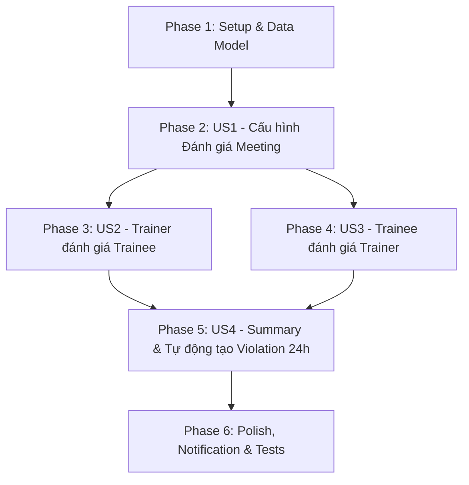

# Tasks: Đánh Giá 2 Chiều Cá Nhân Buổi Học (Trainer & Trainee)

**Input**: Design documents from `specs/004-meeting-evaluation/`
**Prerequisites**: [plan.md](file:///Users/nguyenhuynh/Documents/dut-ai-manager/specs/004-meeting-evaluation/plan.md), [spec.md](file:///Users/nguyenhuynh/Documents/dut-ai-manager/specs/004-meeting-evaluation/spec.md), [data-model.md](file:///Users/nguyenhuynh/Documents/dut-ai-manager/specs/004-meeting-evaluation/data-model.md), [contracts/evaluation-api.json](file:///Users/nguyenhuynh/Documents/dut-ai-manager/specs/004-meeting-evaluation/contracts/evaluation-api.json)

---

## Phase 1: Setup & Data Foundation

**Purpose**: Thiết lập schema cơ sở dữ liệu, Alembic migration và Domain Entities nền tảng cho hệ thống đánh giá 2 chiều.

- [x] T001 Tạo Alembic migration thêm cột `enable_evaluation` (Boolean, default False) và `evaluation_deadline` (DateTime, nullable) vào bảng `meetings` trong `backend/alembic/versions/`
- [x] T002 Tạo bảng `meeting_evaluations` trong Alembic migration với các trường (`id`, `meeting_id`, `reviewer_id`, `target_user_id`, `evaluation_type`, `is_anonymous`, `scores` JSONB, `average_score` Float, `feedback_text`, `created_at`, `updated_at`) và unique constraint `UNIQUE(meeting_id, reviewer_id, target_user_id)` trong `backend/alembic/versions/`
- [x] T003 [P] Cập nhật Value Objects `EvaluationType` (`TRAINER_TO_TRAINEE`, `TRAINEE_TO_TRAINER`) trong `backend/app/meeting/domain/value_objects.py`
- [x] T004 [P] Cập nhật Domain Entity `Meeting` thêm trường `enable_evaluation` và định nghĩa Entity `MeetingEvaluation` trong `backend/app/meeting/domain/entity.py`
- [x] T005 Cập nhật ORM Models `Meeting` và `MeetingEvaluation` trong `backend/app/meeting/infrastructure/model.py`
- [x] T006 Xây dựng `MeetingEvaluationRepository` (CRUD, tính điểm trung bình, kiểm tra tồn tại phiếu đánh giá) trong `backend/app/meeting/infrastructure/repository.py`

**Checkpoint**: Nền tảng dữ liệu và Repository sẵn sàng cho các Use Cases độc lập.

---

## Phase 2: User Story 1 - Trainer tạo buổi học có cấu hình Đánh giá 2 chiều (Priority: P1) 🎯 MVP Core

**Goal**: Cho phép Trainer bật cờ `enable_evaluation` khi tạo/cập nhật buổi học, tự động tính mốc `evaluation_deadline` (24h sau `end_time`).

**Independent Test**: Tạo một Meeting với `enable_evaluation: true`, kiểm tra kết quả trả về có `enable_evaluation: true` và `evaluation_deadline = end_time + 24h`.

- [x] T007 [P] [US1] Cập nhật Pydantic DTOs `MeetingCreateRequest`, `MeetingUpdateRequest`, `MeetingResponse` thêm `enable_evaluation` và `evaluation_deadline` trong `backend/app/meeting/schemas.py`
- [x] T008 [US1] Cập nhật `CreateMeetingUseCase` tự động thiết lập `enable_evaluation` và tính `evaluation_deadline` trong `backend/app/meeting/application/create_meeting_use_case.py`
- [x] T009 [US1] Cập nhật `UpdateMeetingUseCase` để hỗ trợ cập nhật cấu hình đánh giá trong `backend/app/meeting/application/update_meeting_use_case.py`
- [x] T010 [P] [US1] Cập nhật form tạo/sửa Meeting trên Frontend để thêm toggle "Đánh giá 2 chiều (24h)" trong `frontend/src/features/meeting/`

**Checkpoint**: Trainer có thể tạo và quản lý các buổi học có bật tính năng đánh giá.

---

## Phase 3: User Story 2 - Trainer đánh giá từng Trainee sau buổi học (Priority: P1)

**Goal**: Trainer chấm điểm 4 tiêu chí chuẩn (Chuyên cần, Tương tác, Tiếp thu, Chuẩn bị bài) cho từng học viên tham gia sau khi buổi học kết thúc.

**Independent Test**: Trainer gửi request đánh giá cho 1 Trainee tham gia meeting, kiểm tra bản ghi được lưu với `evaluation_type: TRAINER_TO_TRAINEE`, tính đúng `average_score`.

- [x] T011 [P] [US2] Định nghĩa Schemas `TrainerSubmitEvaluationRequest`, `EvaluationScoreItemDto`, `EvaluationResponse` trong `backend/app/meeting/schemas.py`
- [x] T012 [US2] Xây dựng `SubmitTrainerEvaluationUseCase` (kiểm tra điều kiện meeting đã kết thúc, kiểm tra trainee thuộc danh sách tham gia, tính average_score, lưu evaluation) trong `backend/app/meeting/application/submit_trainer_evaluation_use_case.py`
- [x] T013 [US2] Đăng ký `SubmitTrainerEvaluationUseCase` vào Dishka container trong `backend/app/meeting/providers.py` và export qua `backend/app/meeting/application/__init__.py`
- [x] T014 [US2] Thêm REST endpoint `POST /api/v1/meetings/{meeting_id}/evaluations/trainer` trong `backend/app/meeting/controller.py`
- [x] T015 [P] [US2] Xây dựng UI Modal `TrainerEvaluationModal.tsx` với 4 tiêu chí 1-5 sao và trường nhận xét văn bản trong `frontend/src/features/meeting/components/`

**Checkpoint**: Trainer có thể chấm điểm chi tiết và nhận xét từng Trainee trên giao diện.

---

## Phase 4: User Story 3 - Trainee đánh giá Trainer với tùy chọn Ẩn danh (Priority: P1)

**Goal**: Trainee đã tham gia (`JOINED`/`COMPLETED`) gửi đánh giá cho Trainer theo 4 tiêu chí giảng dạy; hỗ trợ tick chọn "Gửi ẩn danh" (vẫn lưu ID trong DB nhưng mask ở tầng hiển thị).

**Independent Test**: Trainee gửi đánh giá Trainer với `is_anonymous: true`. Kiểm tra DB có lưu `reviewer_id`, nhưng API xem summary không trả về thông tin danh tính của Trainee.

- [x] T016 [P] [US3] Định nghĩa Schemas `TraineeSubmitEvaluationRequest` trong `backend/app/meeting/schemas.py`
- [x] T017 [US3] Xây dựng `SubmitTraineeEvaluationUseCase` (kiểm tra Trainee có tham gia buổi học, chặn gửi trùng lặp, lưu `reviewer_id` và cờ `is_anonymous`) trong `backend/app/meeting/application/submit_trainee_evaluation_use_case.py`
- [x] T018 [US3] Xây dựng `GetMyEvaluationResultUseCase` (cho phép Trainee xem nhận xét Trainer gửi cho mình; chặn nếu Trainee chưa hoàn thành đánh giá Trainer) trong `backend/app/meeting/application/get_my_evaluation_result_use_case.py`
- [x] T019 [US3] Đăng ký use cases vào `backend/app/meeting/providers.py` và export qua `backend/app/meeting/application/__init__.py`
- [x] T020 [US3] Thêm REST endpoints `POST /api/v1/meetings/{meeting_id}/evaluations/trainee` và `GET /api/v1/meetings/{meeting_id}/evaluations/my-result` trong `backend/app/meeting/controller.py`
- [x] T021 [P] [US3] Xây dựng UI Form `TraineeEvaluationModal.tsx` có checkbox "Gửi ẩn danh" và component xem kết quả cá nhân trong `frontend/src/features/meeting/components/`

**Checkpoint**: Trainee đánh giá được Trainer (ẩn danh hoặc công khai) và mở khóa xem kết quả cá nhân.

---

## Phase 5: User Story 4 - Báo cáo tổng hợp, Chế tài 24h & Tự động tạo Vi phạm (Priority: P2)

**Goal**: Tổng hợp điểm số, biểu đồ phân tích tiêu chí cho buổi học; Tác vụ tự động quét sau 24h và tạo `Violation` cho Trainer/Trainee chưa hoàn thành đánh giá.

**Independent Test**: Kích hoạt use case quét hạn chót với meeting quá 24h, kiểm tra bản ghi `Violation` được tạo tự động cho người chưa nộp đánh giá.

- [x] T022 [P] [US4] Xây dựng `GetMeetingEvaluationSummaryUseCase` (tính trung bình toàn lớp, điểm trung bình từng tiêu chí, danh sách nhận xét có mask danh tính cho các đánh giá ẩn danh) trong `backend/app/meeting/application/get_meeting_evaluation_summary_use_case.py`
- [x] T023 [US4] Xây dựng `CheckEvaluationDeadlineJobUseCase` (quét các meeting đã kết thúc quá 24h, tìm Trainee đã tham gia nhưng chưa đánh giá Trainer $\rightarrow$ tạo `Violation`, tìm Trainer chưa đánh giá đủ Trainee $\rightarrow$ tạo `Violation`) trong `backend/app/meeting/application/check_evaluation_deadline_job_use_case.py`
- [x] T024 [US4] Đăng ký use case và thiết lập cron job định kỳ trong `backend/app/jobs/cron_jobs.py` và `backend/app/meeting/providers.py`
- [x] T025 [US4] Thêm REST endpoint `GET /api/v1/meetings/{meeting_id}/evaluations/summary` trong `backend/app/meeting/controller.py`
- [x] T026 [P] [US4] Xây dựng UI Component `MeetingEvaluationSummaryView.tsx` hiển thị Dashboard phân tích điểm và danh sách góp ý trong `frontend/src/features/meeting/components/`

**Checkpoint**: Báo cáo tổng hợp trực quan và cơ chế kỷ luật tự động 24h hoạt động trơn tru.

---

## Phase 6: Polish & Cross-Cutting Concerns

**Purpose**: Hoàn thiện tích hợp, thông báo nhắc nhở và kiểm thử tích hợp toàn diện.

- [x] T027 [P] Tích hợp gửi thông báo nhắc nhở đánh giá qua EventBus / Discord / Zalo khi meeting kết thúc và khi sắp hết hạn 24h trong `backend/app/meeting/application/event_handlers.py`
- [x] T028 Viết Unit Tests cho các Use Cases đánh giá (`SubmitTrainerEvaluationUseCase`, `SubmitTraineeEvaluationUseCase`, `CheckEvaluationDeadlineJobUseCase`) trong `backend/tests/unit/meeting/`
- [x] T029 Chạy kịch bản kiểm thử End-to-End theo `specs/004-meeting-evaluation/quickstart.md` và kiểm tra toàn bộ luồng giao diện Frontend

---

## Dependencies & Execution Order

---

## Implementation Strategy (MVP Incremental Delivery)

1. **Bước 1 (MVP)**: Hoàn thành Phase 1 + Phase 2 + Phase 3 $\rightarrow$ Trainer có thể tạo meeting và chấm điểm các Trainee.
2. **Bước 2**: Hoàn thành Phase 4 $\rightarrow$ Trainee gửi phản hồi trực tiếp cho Trainer (có tùy chọn ẩn danh) và xem kết quả của mình.
3. **Bước 3**: Hoàn thành Phase 5 $\rightarrow$ Báo cáo thống kê toàn diện và kích hoạt bộ máy tự động tạo `Violation` sau 24h.
4. **Bước 4**: Hoàn thành Phase 6 $\rightarrow$ Kiểm thử tự động và thông báo Bot.
