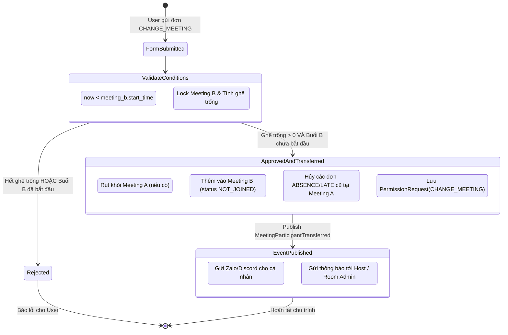

# Data Model: Đơn Xin Đổi Buổi Sinh Hoạt / Meeting (`CHANGE_MEETING`)

**Branch**: `007-change-meeting-permission-request` | **Date**: 2026-10-07

## 1. Value Objects

### `RequestCategory` (Domain Value Object)
```python
class RequestCategory(str, Enum):
    ABSENCE = "ABSENCE"          # Xin vắng sinh hoạt
    POSTPONE = "POSTPONE"        # Xin hoãn bài tập
    LATE = "LATE"                # Xin đi trễ
    OTHER = "OTHER"              # Khác
    CHANGE_MEETING = "CHANGE_MEETING"  # Xin đổi buổi sinh hoạt (MỚI)
```

---

## 2. Entities & Aggregates

### `PermissionRequest` (Domain Entity)
```python
class PermissionRequest(BaseEntity):
    user_id: int | None
    category: RequestCategory
    note: str
    
    # Metadata fields
    homework_id: int | None = None
    meeting_id: int | None = None      # Meeting đích (Meeting B)
    old_meeting_id: int | None = None  # Meeting cũ cần đổi đi (Meeting A, optional)
    start_time: datetime | None = None # Giờ xin đến (nếu LATE) hoặc thời gian đổi
    
    # Relationships (Value Object snapshots)
    owner: UserRef | None = None
    creator: UserRef | None = None
    updater: UserRef | None = None
    homework: Homework | None = None
    meeting: Meeting | None = None         # Thông tin Meeting B
    old_meeting: Meeting | None = None     # Thông tin Meeting A
```

### `Meeting` (Domain Aggregate) - Bổ sung phương thức tính ghế trống
```python
class Meeting(BaseEntity):
    # Các trường hiện có...
    title: str
    start_time: datetime
    end_time: datetime
    participants: list[MeetingParticipant] = Field(default_factory=list)

    def calculate_available_seats(
        self,
        max_seats: int,
        absence_user_ids: set[int],
    ) -> int:
        """
        Tính số ghế khả dụng còn lại của buổi họp:
        Ghế khả dụng = MAX_SEATS - (Số participant active không có đơn ABSENCE hợp lệ)
        """
        active_participants = [
            p for p in self.participants 
            if not p.is_deleted and p.user_id not in absence_user_ids
        ]
        occupied_count = len(active_participants)
        return max(0, max_seats - occupied_count)
```

---

## 3. Database Schema Evolution

### Table `permission_requests` (SQLAlchemy 2.0 ORM)

```sql
ALTER TABLE permission_requests 
ADD COLUMN old_meeting_id INTEGER REFERENCES meetings(id) ON DELETE SET NULL;

CREATE INDEX ix_permission_requests_old_meeting_id ON permission_requests(old_meeting_id);
```

```python
class PermissionRequest(SQLAlchemyTimestampMixin, Base):
    __tablename__ = "permission_requests"
    
    # Các trường hiện có...
    id: Mapped[int] = mapped_column(primary_key=True, autoincrement=True)
    category: Mapped[RequestCategory] = mapped_column(String(100), index=True)
    note: Mapped[str] = mapped_column(String(500))
    start_time: Mapped[datetime | None] = mapped_column(DateTime, default=None)
    homework_id: Mapped[int | None] = mapped_column(ForeignKey("homeworks.id"), default=None, index=True)
    meeting_id: Mapped[int | None] = mapped_column(ForeignKey("meetings.id"), default=None, index=True)
    
    # Trường mới
    old_meeting_id: Mapped[int | None] = mapped_column(
        ForeignKey("meetings.id"), default=None, index=True
    )
    
    # Relationships
    meeting: Mapped["Meeting | None"] = relationship(foreign_keys=[meeting_id])
    old_meeting: Mapped["Meeting | None"] = relationship(foreign_keys=[old_meeting_id])
```

---

## 4. Domain Events

### `MeetingParticipantTransferred` (Domain Event)
```python
@dataclass
class MeetingParticipantTransferred(DomainEvent):
    request_id: int
    user_id: int
    old_meeting_id: int | None
    new_meeting_id: int
    timestamp: datetime = field(default_factory=get_current_utc7_time)
```

---

## 5. State Transition & Lifecycle Diagram


