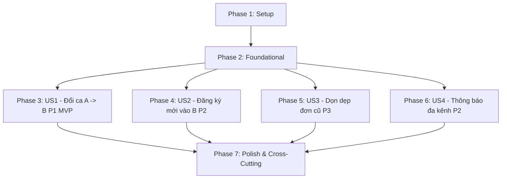

# Tasks: Đơn Xin Đổi Buổi Sinh Hoạt / Meeting (`CHANGE_MEETING`)

**Input**: Design documents from `specs/007-change-meeting-permission-request/` (`spec.md`, `plan.md`, `research.md`, `data-model.md`, `contracts/permission-request-api.yaml`, `quickstart.md`)

**Prerequisites**: `plan.md`, `spec.md`, `data-model.md`, `contracts/`

**Tests**: Automated tests using `pytest` included for backend domain, use cases, and controllers.

---

## Phase 1: Setup (Shared Infrastructure)

**Purpose**: Thiết lập nền tảng enum, model, và migration cơ sở dữ liệu.

- [X] T001 [P] Thêm giá trị `CHANGE_MEETING = "CHANGE_MEETING"` vào `RequestCategory` enum tại `backend/app/permission_request/domain/value_objects.py`
- [X] T002 [P] Bổ sung trường `old_meeting_id: int | None = None` và snapshot quan hệ `old_meeting: Meeting | None = None` vào Entity `PermissionRequest` tại `backend/app/permission_request/domain/entity.py`
- [X] T003 [P] Cập nhật ORM model `PermissionRequest` thêm cột `old_meeting_id` (ForeignKey `meetings.id`, nullable) và relationship `old_meeting` tại `backend/app/permission_request/infrastructure/model.py`
- [X] T004 Tạo file Alembic migration `backend/alembic/versions/add_change_meeting_and_old_meeting_id.py` để thêm cột `old_meeting_id` và cập nhật enum `requestcategory`

---

## Phase 2: Foundational (Blocking Prerequisites)

**Purpose**: Xây dựng phương thức tính toán ghế khả dụng, khóa giao dịch và repository cơ sở.

**⚠️ CRITICAL**: Các User Story phía sau phụ thuộc vào các phương thức nền tảng này.

- [X] T005 Triển khai phương thức tính ghế khả dụng `calculate_available_seats(max_seats: int, absence_user_ids: set[int]) -> int` trong Domain Entity `Meeting` tại `backend/app/meeting/domain/entity.py` theo công thức $\text{MAX\_SEATS} - (\text{Active Participants} - \text{Đơn ABSENCE})$
- [X] T006 [P] Bổ sung phương thức `get_meeting_with_lock(meeting_id: int) -> Meeting | None` sử dụng `with_for_update()` trong `MeetingRepository` tại `backend/app/meeting/infrastructure/repository.py`
- [X] T007 [P] Bổ sung phương thức hủy mềm các đơn `ABSENCE` và `LATE` theo `user_id` và `meeting_id` (`cancel_active_requests_by_meeting`) trong `PermissionRequestRepository` tại `backend/app/permission_request/infrastructure/repository.py`
- [X] T008 [P] Cập nhật Pydantic Schemas (`PermissionRequestCreate`, `PermissionRequestResponse`, `MeetingSeatAvailabilityDto`) tại `backend/app/permission_request/schemas.py` và `backend/app/meeting/schemas.py`

**Checkpoint**: Nền tảng dữ liệu và query locking đã sẵn sàng để phát triển các User Stories.

---

## Phase 3: User Story 1 - Thành viên xin chuyển từ Meeting A sang Meeting B còn chỗ (Priority: P1) 🎯 MVP

**Goal**: Cho phép thành viên đang ở Meeting A nộp đơn đổi sang Meeting B trong tương lai còn chỗ. Hệ thống tự động kiểm tra ghế trống, khóa transaction, rút khỏi A, thêm vào B và hoàn tất đơn.

**Independent Test**: Nộp đơn đổi từ Meeting A sang B khi B còn 5 ghế $\rightarrow$ Thành công, User được rút khỏi A, thêm vào B, ghế B giảm 1. Nộp đơn khi B đầy $\rightarrow$ Báo lỗi 400 hết chỗ.

### Tests for User Story 1
- [X] T009 [P] [US1] Viết unit & integration tests kiểm thử logic chuyển ca (chuyển thành công, từ chối khi hết ghế, từ chối khi ca đích trong quá khứ) trong `backend/tests/test_change_meeting_permission_request.py`

### Implementation for User Story 1
- [X] T010 [US1] Triển khai Use Case chuyên biệt `CreateChangeMeetingRequestUseCase` trong `backend/app/permission_request/application/create_change_meeting_request_use_case.py` xử lý kiểm tra thời gian `now < meeting_b.start_time`, khóa Meeting B, tính ghế khả dụng, chuyển participant và lưu `PermissionRequest`
- [X] T011 [US1] Cập nhật `backend/app/permission_request/application/__init__.py` để re-export `CreateChangeMeetingRequestUseCase` tuân thủ Constitution Principle VII
- [X] T012 [US1] Đăng ký `CreateChangeMeetingRequestUseCase` vào Dishka IoC container tại `backend/app/permission_request/providers.py`
- [X] T013 [US1] Cập nhật endpoint `POST /api/v1/permission-requests` trong `backend/app/permission_request/controller.py` để định tuyến category `CHANGE_MEETING` tới `CreateChangeMeetingRequestUseCase`
- [X] T014 [P] [US1] Bổ sung `CHANGE_MEETING` vào `RequestCategory` enum và schema tại `zalo-mini-app/dut-manager/src/types/permission.types.ts`
- [X] T015 [US1] Cập nhật giao diện `PermissionFormModal.tsx` tại `zalo-mini-app/dut-manager/src/features/permission_request/PermissionFormModal.tsx` hiển thị 2 dropdown: Buổi họp hiện tại (Meeting A) và Buổi họp đích trong tương lai (Meeting B) kèm tag hiển thị số ghế còn lại
- [X] T016 [US1] Cập nhật `usePermissionManagement.ts` tại `zalo-mini-app/dut-manager/src/features/permission_request/usePermissionManagement.ts` xử lý payload `old_meeting_id` và `meeting_id` khi submit form `CHANGE_MEETING`
- [X] T017 [P] [US1] Cập nhật `PermissionList.tsx` và `PermissionDetailModal.tsx` tại `zalo-mini-app/dut-manager/src/features/permission_request/` hiển thị badge "Đổi buổi sinh hoạt" và thông tin chi tiết chuyển ca

**Checkpoint**: User Story 1 hoàn thành độc lập — học viên có thể đổi ca sinh hoạt thành công từ Zalo Mini App và API.

---

## Phase 4: User Story 2 - Thành viên chưa có buổi học xin đăng ký vào Meeting B (Priority: P2)

**Goal**: Hỗ trợ học viên chưa có tên trong buổi học nào chọn "Chưa có buổi học nào" và đăng ký vào Meeting B trong tương lai còn chỗ.

**Independent Test**: User không thuộc meeting nào chọn `old_meeting_id = None` và `meeting_id = B` $\rightarrow$ Ghi danh thành công vào Meeting B.

### Tests for User Story 2
- [X] T018 [P] [US2] Bổ sung test cases kiểm thử trường hợp đăng ký mới (`old_meeting_id = None`) trong `backend/tests/test_change_meeting_permission_request.py`

### Implementation for User Story 2
- [X] T019 [US2] Cập nhật logic trong `CreateChangeMeetingRequestUseCase` tại `backend/app/permission_request/application/create_change_meeting_request_use_case.py` cho phép `old_meeting_id` là `None` và bỏ qua bước rút khỏi ca cũ
- [X] T020 [US2] Cập nhật `PermissionFormModal.tsx` tại `zalo-mini-app/dut-manager/src/features/permission_request/PermissionFormModal.tsx` bổ sung tùy chọn mặc định "Chưa có buổi học nào (Đăng ký mới)" trong dropdown chọn ca cũ

**Checkpoint**: User Story 2 hoàn thành — học viên chưa có lịch có thể tự đăng ký vào ca học còn chỗ.

---

## Phase 5: User Story 3 - Tự động dọn dẹp đơn xin vắng/trễ cũ khi chuyển ca thành công (Priority: P3)

**Goal**: Tự động vô hiệu hóa/hủy các đơn `ABSENCE` hoặc `LATE` của người dùng tại Meeting A khi chuyển sang Meeting B thành công.

**Independent Test**: User có đơn xin vắng tại Meeting A, thực hiện đổi sang Meeting B $\rightarrow$ Đơn xin vắng cũ tại A chuyển sang trạng thái đã xóa (`is_deleted = True`), không gây sai lệch thống kê điểm danh.

### Tests for User Story 3
- [X] T021 [P] [US3] Bổ sung test cases xác minh tự động hủy đơn vắng/trễ cũ trong `backend/tests/test_change_meeting_permission_request.py`

### Implementation for User Story 3
- [X] T022 [US3] Tích hợp gọi `cancel_active_requests_by_meeting(user_id, old_meeting_id)` bên trong transaction của `CreateChangeMeetingRequestUseCase` tại `backend/app/permission_request/application/create_change_meeting_request_use_case.py`

**Checkpoint**: User Story 3 hoàn thành — dữ liệu điểm danh và vi phạm luôn nhất quán và sạch sẽ.

---

## Phase 6: User Story 4 - Thông báo đa kênh & Ghi nhật ký kiểm toán (Priority: P2)

**Goal**: Gửi thông báo Telegram/Zalo cho thành viên xác nhận ca mới, thông báo biến động danh sách tới Host/Admin của Meeting A & B, và lưu vết kiểm toán.

**Independent Test**: Đổi ca thành công $\rightarrow$ Phát sự kiện `MeetingParticipantTransferred`, gửi tin nhắn xác nhận cho User và gửi tin thông báo vào room quản lý Discord/Zalo.

### Tests for User Story 4
- [X] T023 [P] [US4] Viết test kiểm thử việc phát sự kiện `MeetingParticipantTransferred` và xử lý gửi thông báo trong `backend/tests/test_change_meeting_permission_request.py`

### Implementation for User Story 4
- [X] T024 [P] [US4] Tạo Domain Event `MeetingParticipantTransferred` trong `backend/app/permission_request/domain/events.py`
- [X] T025 [US4] Cập nhật `PermissionRequestNotificationHandler` tại `backend/app/permission_request/application/event_handlers.py` lắng nghe `MeetingParticipantTransferred` và gửi thông báo đa kênh qua `NotificationService` tới thành viên và Host/Admin room
- [X] T026 [US4] Đăng ký subscription sự kiện `MeetingParticipantTransferred` vào `EventBus` tại `backend/app/core/events.py`

**Checkpoint**: User Story 4 hoàn thành — thông báo tự động và lưu vết kiểm toán hoạt động trơn tru.

---

## Phase 7: Polish & Cross-Cutting Concerns

**Purpose**: Cung cấp API truy vấn số ghế khả dụng của các buổi họp sắp tới và hoàn thiện kiểm thử toàn diện.

- [X] T027 [P] Triển khai Use Case `GetUpcomingMeetingsWithSeatsUseCase` tại `backend/app/meeting/application/get_upcoming_meetings_with_seats_use_case.py` và đăng ký Dishka provider
- [X] T028 [P] Thêm endpoint `GET /api/v1/meetings/available-seats` trong `backend/app/meeting/controller.py` trả về danh sách ca kèm số ghế khả dụng
- [X] T029 Chạy toàn bộ test suite `pytest backend/tests/` và xác minh toàn bộ kịch bản trong `specs/007-change-meeting-permission-request/quickstart.md`
- [X] T030 [P] Kiểm tra build TypeScript cho Zalo Mini App (`npm run build` trong `zalo-mini-app/dut-manager/`)

---

## Dependencies & Execution Order

### Phase Dependencies

### User Story Dependencies

- **User Story 1 (P1 - MVP)**: Có thể bắt đầu ngay sau Phase 2 (Foundational). Là luồng nghiệp vụ trung tâm.
- **User Story 2 (P2)**: Mở rộng từ US1 bằng cách hỗ trợ `old_meeting_id = None`.
- **User Story 3 (P3)**: Tích hợp vào bước dọn dẹp dữ liệu của transaction trong US1.
- **User Story 4 (P2)**: Xử lý asynchronous side-effects sau khi transaction của US1/US2 hoàn tất.

---

## Implementation Strategy

### MVP First (User Story 1 Only)
1. Hoàn thành **Phase 1: Setup** và **Phase 2: Foundational**.
2. Triển khai **Phase 3: User Story 1**.
3. Chạy kiểm thử tự động xác minh đổi ca thành công và chống tràn ghế.
4. Triển khai tiếp các User Stories 2, 3, 4 theo hình thức gia tăng giá trị (Incremental Delivery).
