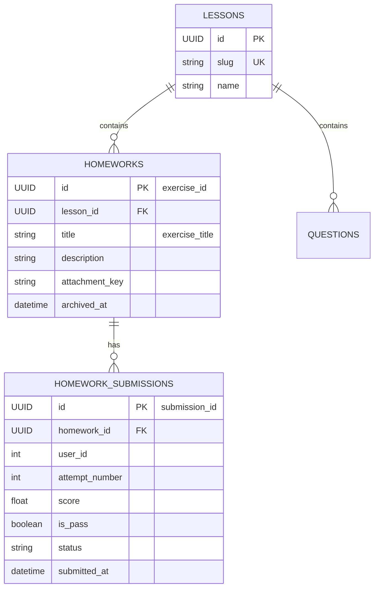

# Data Model & Schema Design: Quản Lý Và Lưu Vết Chi Tiết Lịch Sử Từng Bài Tập Coding

**Feature**: `008-detailed-exercise-history`  
**Date**: 2026-10-06  
**Status**: Completed

---

## 1. Mô Hình Dữ Liệu DUT-AI Manager

### 1.1 Domain Entity: `HomeworkSubmission`

```python
from datetime import datetime
from enum import StrEnum
from app.shared.domain.base_entity import BaseEntity


class SubmissionType(StrEnum):
    CODING = "CODING"
    GAME = "GAME"


class HomeworkSubmission(BaseEntity):
    """Domain model đại diện cho một bản ghi nộp bài (coding exercise hoặc game session)."""

    homework_id: int
    user_id: int
    submission_type: SubmissionType
    submitted_at: datetime
    
    # Trường bổ sung cho bài tập coding con
    exercise_id: str | None = None          # UUID của bài tập bên Quiz (dạng string)
    exercise_title: str | None = None       # Tên bài tập coding con
    score: float | None = None              # Điểm số đạt được
    attempt_number: int = 1                 # Lần nộp bài thứ mấy
    
    is_passed: bool = True                  # Đạt chuẩn bài nộp hay không
    details: dict | None = None             # Thông tin chi tiết (file name, logs, submission_id...)
    created_at: datetime | None = None
```

---

### 1.2 Database Model: `HomeworkSubmissionModel`

```python
from datetime import datetime
from sqlalchemy import JSON, Boolean, DateTime, Float, ForeignKey, Integer, String, Index
from sqlalchemy.orm import Mapped, mapped_column, relationship
from app.shared.infrastructure.base_model import Base
from app.utils.datetime import get_current_utc7_time
from app.homework.domain.entity import HomeworkSubmission as HomeworkSubmissionEntity, SubmissionType


class HomeworkSubmissionModel(Base):
    """Bảng lưu vết lịch sử nộp bài tập chi tiết của học viên."""

    __tablename__ = "homework_submissions"

    id: Mapped[int] = mapped_column(primary_key=True, autoincrement=True)
    homework_id: Mapped[int] = mapped_column(
        ForeignKey("homeworks.id", ondelete="CASCADE"), index=True, nullable=False
    )
    user_id: Mapped[int] = mapped_column(
        ForeignKey("users.id", ondelete="CASCADE"), index=True, nullable=False
    )
    submission_type: Mapped[str] = mapped_column(String(20), nullable=False)
    
    # Khóa ngoại logic & thông tin bài tập con từ Quiz
    exercise_id: Mapped[str | None] = mapped_column(String(64), index=True, nullable=True)
    exercise_title: Mapped[str | None] = mapped_column(String(255), nullable=True)
    score: Mapped[float | None] = mapped_column(Float, nullable=True)
    attempt_number: Mapped[int] = mapped_column(
        Integer, default=1, server_default="1", nullable=False
    )
    
    submitted_at: Mapped[datetime] = mapped_column(
        DateTime, default=get_current_utc7_time, nullable=False
    )
    is_passed: Mapped[bool] = mapped_column(
        Boolean, default=True, server_default="true", nullable=False
    )
    details: Mapped[dict | None] = mapped_column(
        JSON, default=dict, server_default="{}", nullable=True
    )
    created_at: Mapped[datetime] = mapped_column(
        DateTime, default=get_current_utc7_time, nullable=False
    )

    homework: Mapped["HomeworkModel"] = relationship(back_populates="submissions")

    __table_args__ = (
        Index(
            "ix_hw_submissions_lookup",
            "homework_id",
            "user_id",
            "exercise_id",
        ),
    )

    def to_entity(self) -> HomeworkSubmissionEntity:
        return HomeworkSubmissionEntity(
            id=self.id,
            homework_id=self.homework_id,
            user_id=self.user_id,
            submission_type=SubmissionType(self.submission_type),
            exercise_id=self.exercise_id,
            exercise_title=self.exercise_title,
            score=self.score,
            attempt_number=self.attempt_number,
            submitted_at=self.submitted_at,
            is_passed=self.is_passed,
            details=self.details or {},
            created_at=self.created_at,
        )
```

---

### 1.3 Kế Hoạch Migration Database (Alembic)

```python
"""add exercise details to homework_submissions

Revision ID: add_exercise_details_to_submissions
Revises: <previous_revision>
Create Date: 2026-10-06 14:30:00.000000
"""
from alembic import op
import sqlalchemy as sa

def upgrade():
    op.add_column("homework_submissions", sa.Column("exercise_id", sa.String(length=64), nullable=True))
    op.add_column("homework_submissions", sa.Column("exercise_title", sa.String(length=255), nullable=True))
    op.add_column("homework_submissions", sa.Column("score", sa.Float(), nullable=True))
    op.add_column("homework_submissions", sa.Column("attempt_number", sa.Integer(), server_default="1", nullable=False))
    
    op.create_index("ix_homework_submissions_exercise_id", "homework_submissions", ["exercise_id"])
    op.create_index(
        "ix_hw_submissions_lookup",
        "homework_submissions",
        ["homework_id", "user_id", "exercise_id"],
    )

def downgrade():
    op.drop_index("ix_hw_submissions_lookup", table_name="homework_submissions")
    op.drop_index("ix_homework_submissions_exercise_id", table_name="homework_submissions")
    op.drop_column("homework_submissions", "attempt_number")
    op.drop_column("homework_submissions", "score")
    op.drop_column("homework_submissions", "exercise_title")
    op.drop_column("homework_submissions", "exercise_id")
```

---

## 2. Mô Hình Dữ Liệu DUT-AI Quiz

DUT-AI Quiz duy trì mô hình dữ liệu quan hệ sẵn có và bổ sung trường metadata trả về cho Manager:


