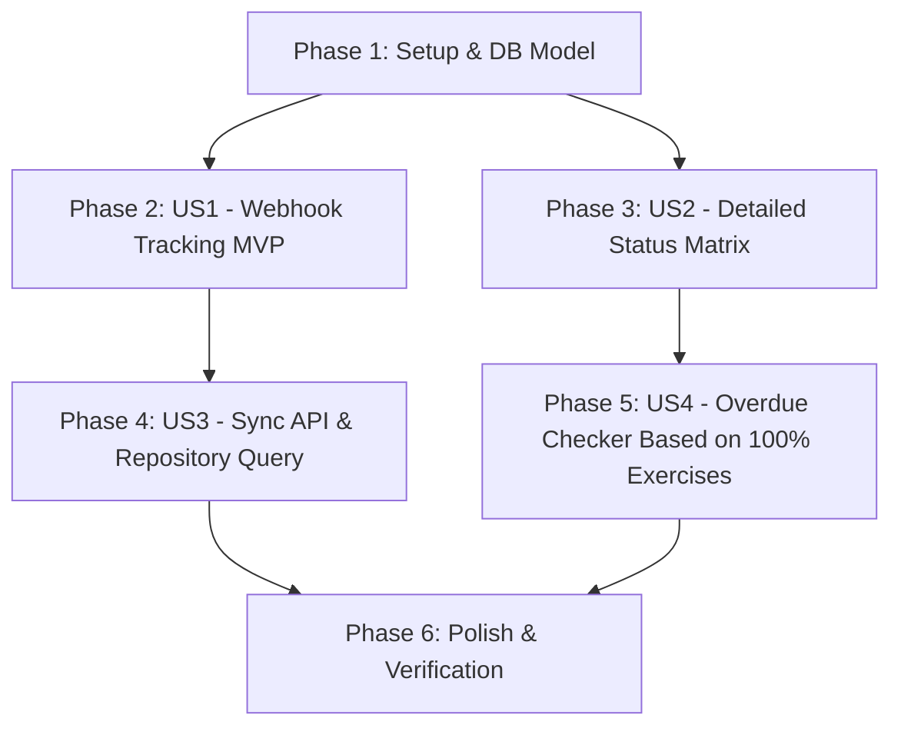

# Tasks: Quản Lý Và Lưu Vết Chi Tiết Lịch Sử Từng Bài Tập Coding

**Input**: Design documents from `specs/008-detailed-exercise-history/` (`plan.md`, `spec.md`, `research.md`, `data-model.md`, `contracts/`)  
**Prerequisites**: `plan.md`, `spec.md`, `data-model.md`, `contracts/`  
**Organization**: Tasks được phân chia theo từng User Story độc lập, có thể kiểm thử và bàn giao theo từng bước (MVP -> Full Feature).

---

## Format: `[ID] [P?] [Story] Description`
- **[P]**: Có thể thực hiện song song (khác file, không phụ thuộc task chưa xong).
- **[Story]**: Đánh dấu thuộc User Story nào (US1, US2, US3, US4).
- Ghi rõ đường dẫn file chính xác trong từng task.

---

## Phase 1: Setup & Data Model Foundation (Shared Infrastructure)

**Mục đích**: Chuẩn bị cấu trúc dữ liệu, database model, migration và entities làm nền tảng cho việc lưu vết bài tập con.

- [x] T001 [P] Cập nhật entity `HomeworkSubmission` trong `backend/app/homework/domain/entity.py` bổ sung các trường `exercise_id: str | None`, `exercise_title: str | None`, `score: float | None`, `attempt_number: int = 1`.
- [x] T002 [P] Cập nhật `HomeworkSubmissionModel` trong `backend/app/homework/infrastructure/model.py` bổ sung các cột `exercise_id`, `exercise_title`, `score`, `attempt_number` và composite index `ix_hw_submissions_lookup`.
- [x] T003 Tạo file Alembic migration trong `backend/alembic/versions/` để thêm các cột `exercise_id`, `exercise_title`, `score`, `attempt_number` và tạo index cho bảng `homework_submissions`.
- [x] T004 [P] Cập nhật `HomeworkRepository` trong `backend/app/homework/infrastructure/repository.py` bổ sung phương thức tìm kiếm và upsert bài nộp theo `(homework_id, user_id, exercise_id)`.
- [x] T005 [P] Cập nhật DTOs đồng bộ trong `dut-ai-quiz/apps/api/app/application/dtos/homework.py` bổ sung `exercise_id`, `exercise_title`, `score` vào `HomeworkSubmissionSyncOutDTO`.

---

## Phase 2: User Story 1 - Ghi nhận & lưu vết bài nộp con qua Webhook (Priority: P1) 🎯 MVP

**Mục tiêu**: Khi học viên nộp 1 bài tập coding cụ thể trên Quiz, Manager nhận Webhook và lưu vết chính xác bản ghi của bài tập con đó.

**Independent Test**: Gửi payload Webhook mô phỏng nộp bài tập A và bài tập B của cùng một lesson. Kiểm tra database Manager có 2 bản ghi submission riêng biệt chứa đúng `exercise_id` và thông tin chi tiết.

- [x] T006 [P] [US1] Định nghĩa Pydantic Model `HomeworkSubmissionWebhookIn` trong `backend/app/homework/application/record_submission_use_case.py` validate đầy đủ `exercise_id`, `exercise_title`, `submission_id`, `attempt_number`, `score`, `submitted_at`.
- [x] T007 [US1] Nâng cấp `RecordHomeworkSubmissionUseCase` trong `backend/app/homework/application/record_submission_use_case.py` thực hiện idempotent upsert bài nộp theo `(homework_id, user_id, exercise_id)`.
- [x] T008 [P] [US1] Cập nhật `dispatch_manage_submission_webhook` và `_send_webhook_request` trong `dut-ai-quiz/apps/api/app/infrastructure/services/manage_webhook.py` nhận và gửi payload chứa `exercise_id`, `exercise_title`, `score`, `attempt_number`.
- [x] T009 [US1] Cập nhật use case `SubmitHomeworkUseCase` trong `dut-ai-quiz/apps/api/app/application/use_cases/homeworks/submit_homework_uc.py` gọi webhook dispatch kèm `exercise_id` (UUID bài tập) và `exercise_title`.
- [x] T010 [US1] Cập nhật toàn bộ Unit Tests trong `backend/tests/test_homework_webhook.py` kiểm thử webhook nộp từng bài tập con, nộp lại nhiều lần (attempt > 1) và xử lý lỗi dữ liệu không hợp lệ.

**Checkpoint MVP**: Đã có thể nhận và lưu vết chính xác từng bài tập con từ Quiz sang Manager qua Webhook thời gian thực.

---

## Phase 3: User Story 2 - Theo dõi tiến độ chi tiết từng bài tập con trên Manager (Priority: P1)

**Mục tiêu**: Giảng viên/Admin xem được danh sách $N$ bài tập coding con của bài học và ma trận tiến độ hoàn thành ($k/N$) của từng học viên.

**Independent Test**: Gọi API `GET /homeworks/{id}/submission-status` trên Manager và xác nhận phản hồi trả về danh sách các bài tập con (`coding_exercises`) và tiến độ chi tiết của từng học viên.

- [x] T011 [P] [US2] Thêm endpoint `GET /api/v1/lessons/{lesson_slug}/exercises` trong `dut-ai-quiz/apps/api/app/presentation/api/routers/lessons.py` trả về danh sách bài tập coding con active của lesson.
- [x] T012 [P] [US2] Thêm phương thức `get_lesson_exercises(lesson_slug)` trong `backend/app/homework/infrastructure/quiz_api.py` để gọi Quiz API lấy danh sách bài tập con.
- [x] T013 [P] [US2] Khai báo các Pydantic DTOs phản hồi (`ExerciseSummaryDTO`, `StudentExerciseStatusDTO`, `StudentHomeworkDetailDTO`, `HomeworkDetailedSubmissionStatusResponse`) trong `backend/app/homework/application/dtos.py`.
- [x] T014 [US2] Cập nhật helper `QuizSubmissionHelper` trong `backend/app/homework/application/helpers.py` hỗ trợ tính toán ma trận hoàn thành $k/N$ bài tập con.
- [x] T015 [US2] Nâng cấp `GetHomeworkSubmissionStatusUseCase` trong `backend/app/homework/application/get_homework_submission_status_use_case.py` kết hợp dữ liệu bài tập con từ Quiz và submissions trong DB để dựng response chi tiết.
- [x] T016 [US2] Cập nhật controller `backend/app/homework/controller.py` xuất bản response schema mới cho `GET /homeworks/{id}/submission-status`.

---

## Phase 4: User Story 3 - Đồng bộ dữ liệu lịch sử bài nộp chi tiết (Sync API) (Priority: P2)

**Mục tiêu**: Đảm bảo đồng bộ và đối soát dữ liệu toàn diện giữa Quiz và Manager ngay cả khi webhook bị gián đoạn.

**Independent Test**: Gọi API đồng bộ hoặc chạy rescan trên Manager và kiểm tra dữ liệu bài nộp của tất cả bài tập con được cập nhật khớp với Quiz.

- [x] T017 [P] [US3] Cập nhật hàm `list_completed_members_by_lesson` trong `dut-ai-quiz/apps/api/app/infrastructure/repositories/homeworks.py` kiểm tra điều kiện `count(DISTINCT homework_id) == count_active_homeworks`.
- [x] T018 [P] [US3] Cập nhật hàm `list_submissions_for_sync_by_lesson` trong `dut-ai-quiz/apps/api/app/infrastructure/repositories/homeworks.py` trả về `exercise_id`, `exercise_title`, `score`, `attempt_number`.
- [x] T019 [US3] Nâng cấp `SyncHomeworkUseCase` trong `backend/app/homework/application/sync_homework_use_case.py` để phân giải và nạp đồng bộ các bài nộp theo từng bài tập con.

---

## Phase 5: User Story 4 - Quét bài tập quá hạn dựa trên 100% bài tập con (Priority: P2)

**Mục tiêu**: Tác vụ kiểm tra quá hạn chỉ coi học viên hoàn thành khi đã nộp đủ $100\%$ bài tập coding con của lesson.

**Independent Test**: Chạy `CheckOverdueHomeworkUseCase` với học viên nộp thiếu bài khi đã quá deadline, xác nhận phát sự kiện quá hạn chính xác.

- [x] T020 [US4] Cập nhật `CheckOverdueHomeworkUseCase` trong `backend/app/homework/application/check_overdue_homework_use_case.py` kiểm tra điều kiện nộp đủ toàn bộ bài tập con trước khi quyết định quá hạn.
- [x] T021 [US4] Cập nhật / Bổ sung Unit Tests trong `backend/tests/test_homework/` kiểm thử tác vụ quét quá hạn cho các trường hợp nộp đủ $N/N$, nộp thiếu $k/N$ và chưa nộp bài nào.

---

## Phase 6: Polish & Verification (Quality Gates)

**Mục đích**: Chạy migration, kiểm tra static analysis và kiểm thử toàn diện cả 2 repositories.

- [x] T022 Chạy migration database Alembic trên môi trường phát triển local.
- [x] T023 Chạy kiểm tra tĩnh kiểu dữ liệu `make typecheck` trong `dut-ai-manager` đảm bảo 0 lỗi diagnostics.
- [x] T024 Chạy toàn bộ test suite `make test` trên `dut-ai-manager` và pytest trên `dut-ai-quiz` đảm bảo 100% test pass.

---

## Dependencies & Execution Order

---

## Parallel Execution Opportunities

- **Trong Phase 1**: T001, T002, T004, T005 có thể làm song song trên các file khác nhau.
- **Trong Phase 2**: T006 (Pydantic schema Manager) và T008 (Quiz Webhook dispatch) có thể làm song song giữa 2 repo.
- **Trong Phase 3**: T011 (Quiz endpoint exercises), T012 (Manager Quiz Client), T013 (Manager DTOs) có thể thực hiện song song.
